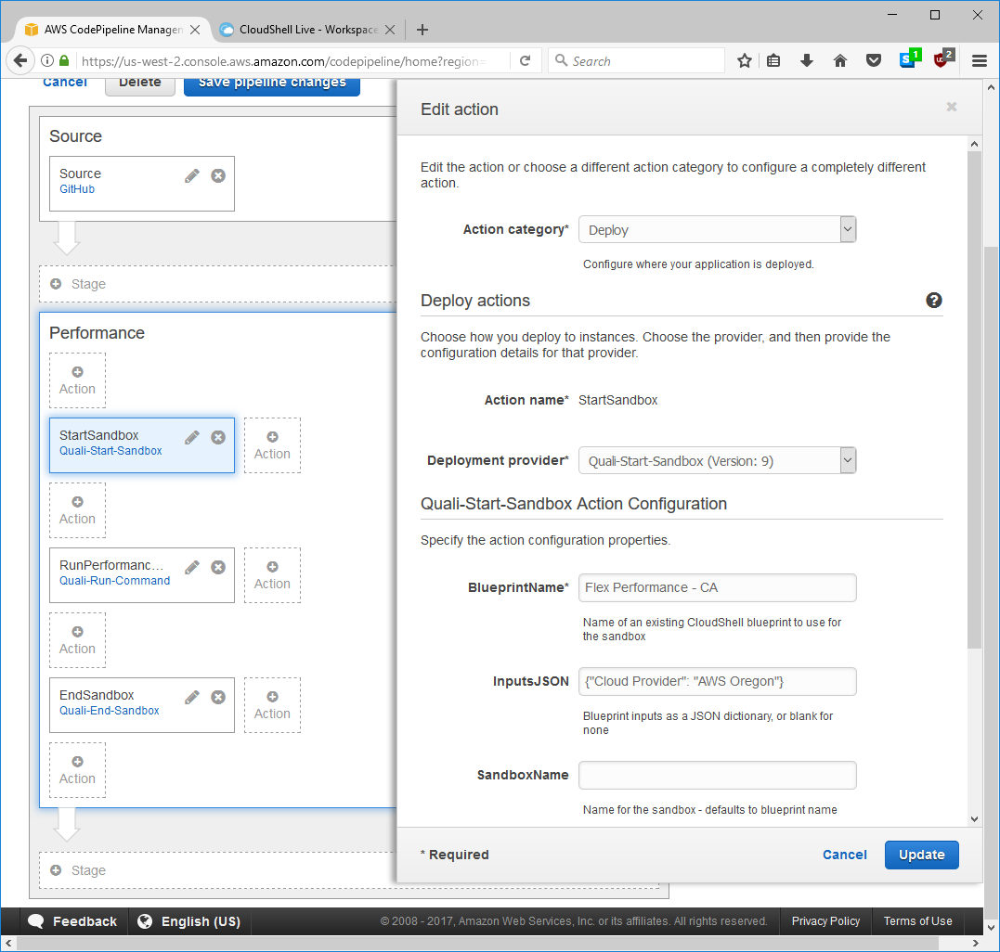
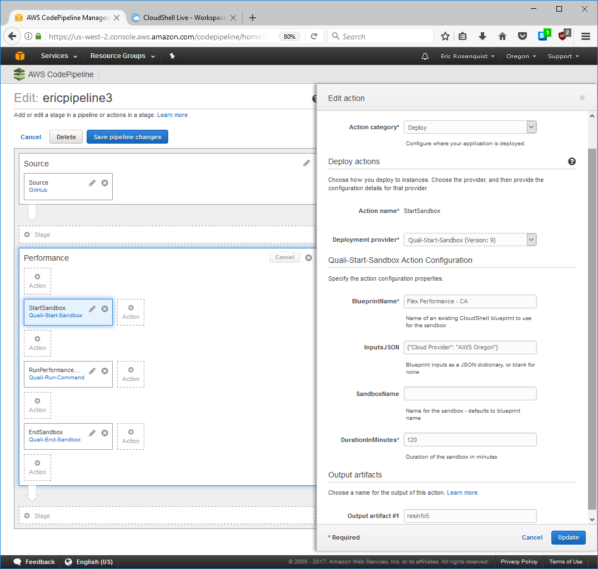
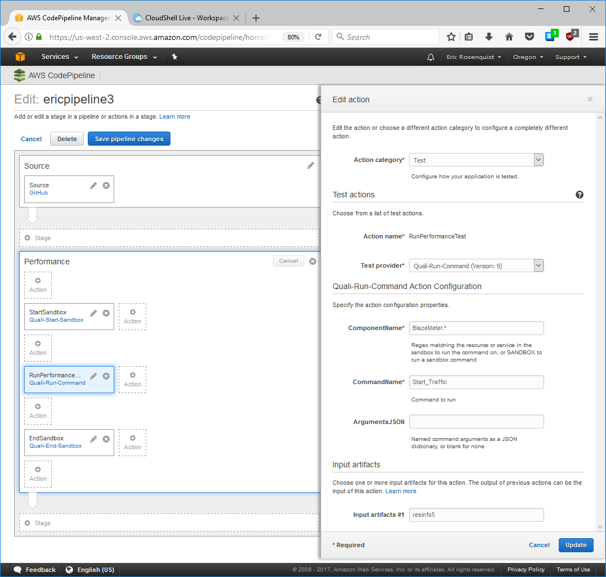
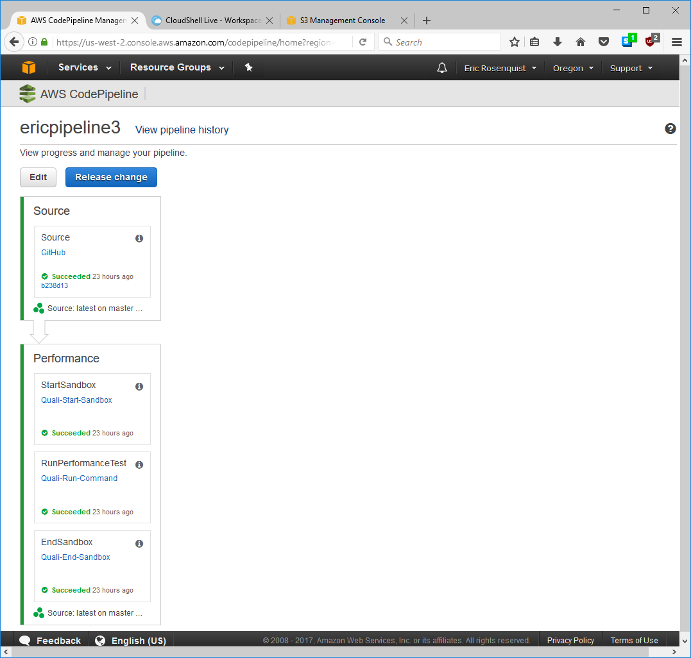

# AWS-CodePipeline

Custom pipeline actions to start and stop sandboxes and
run sandbox and component commands

Quali actions are installed within an individual AWS account
and are available in CodePipeline under that account.

When a pipeline executes, actions are added to a queue
on an Amazon server.

A "job worker" running on some machine, such as 
the CloudShell portal server, 
polls the Amazon server for Quali action requests 
and executes them using the sandbox API.

## Prerequisites

- AWS account with CodePipeline permissions set up: http://docs.aws.amazon.com/codepipeline/latest/userguide/getting-started-codepipeline.html
- To register the actions:
    - Windows or Linux with `python` and `pip` in path
- To run the job worker:
    - Windows or Linux with `python` in path
    - Network access to AWS API
    - Network access to CloudShell sandbox API
    - AWS credentials
        - Key name
        - Secret
    - CloudShell credentials
        - Username
        - Password
        - Domain
        

## Registering and unregistering actions

### Windows

    install_aws_actions.cmd
    uninstall_aws_actions.cmd

### Linux

    bash install_aws_actions.sh
    bash uninstall_aws_actions.sh

## Usage

In the AWS CodePipeline editor, `Quali-Start-Sandbox` and `Quali-End-Sandbox` are found in 
the Deploy category and `Quali-Run-Command` in the `Test` 
category.

Add a `Quali-Start-Sandbox` action to your pipeline:

Enter the name of an existing blueprint. 

**!!! WARNING: Don't forget to "publish" the blueprint. The sandbox API can only access "public" blueprints. !!!**

If the blueprint has inputs, you must include them in the `InputsJSON` field in the form of a JSON dictionary.

`Quali-Start-Sandbox` stores the sandbox id and other information
in an output artifact. You must create a unique name in the 
`Output artifacts #1` field when adding the `Quali-Start-Sandbox` action:

Add a `Quali-Run-Command` action to your pipeline:
 
 
`ComponentName` can be:
- the exact name of a resource or service
- a regular expression that matches a single resource or service &mdash; useful for resources deployed from apps that have random suffixes 
- the word "SANDBOX", to run a sandbox-level command

`CommandName` must be the internal name of the command, not the display name. 
To find out the internal name, look in the Manage>Scripts section of the portal or the 
driver source code.

`ArgumentsJSON` is mandatory if the command takes inputs. Use this format:

    {"Parameter1": "Value1", "Parameter_2": "5"}
 
Add a `Quali-End-Sandbox` action to your pipeline: 
 

To determine the sandbox id, `Quali-Run-Command` and 
`Quali-End-Sandbox` both take an
input artifact that must have been created earlier 
in the pipeline as an output artifact of `Quali-Start-Sandbox`. 
You must enter this same artifact name 
in the `Input artifacts #1` field when adding `Quali-Run-Command` 
and `Quali-End-Sandbox` actions. 

## Editing an action definition

To edit the action JSON files (to customize action titles, support additional inputs, etc.):

- Run the uninstall script to remove the current versions of the actions (optional)
- Increment the version number:
    - in each JSON file
    - in `run_worker.cmd` / `run_worker.sh`
    - in `uninstall_aws_actions.cmd` / `uninstall_aws_actions.sh`
- Run `install_aws_actions.cmd` / `install_aws_actions.sh`

To change the an action title that appears in the GUI (e.g. `Quali-Start-Sandbox`), update the name in:
- the JSON file
- `run_worker.cmd` / `run_worker.sh`
- `uninstall_aws_actions.cmd` / `uninstall_aws_actions.sh`

The scripts and worker code expect all actions to have the same version number.

## Running the job worker

### Windows

Edit `set` lines in `run_worker.cmd` with credentials and server info

    run_worker.cmd

Closing the command will shut down the worker. 

### Linux

Edit `export` lines in `run_worker.sh` with credentials and server info.

Run the worker:

    nohup bash run_worker.sh &
    
## About the job worker

The job worker polls the AWS server for queued actions:

- Quali-Start-Sandbox
- Quali-End-Sandbox
- Quali-Run-Command

It looks only for actions with those names and a single version number.

The scripts expect all actions to have the same version number, so if you edit one action and increment the version number, 
it is simplest to increment the others even though they were not changed. 

Whenever the job worker receives an action from the AWS server, it 
- acknowledges the action back to the AWS server
- launches a thread to handle the action as described below

### Quali-Start-Sandbox
- starts the specified sandbox
- waits for Setup to complete
- uploads the sandbox details as an artifact to the S3 bucket that was generated for the pipeline
- marks the action complete on the AWS server

### Quali-Run-Command
- locates the sandbox by downloading the input artifact from S3 created earlier by a `Quali-Start-Sandbox` action
- starts the command  
- waits up to 15 minutes for it to complete
- marks the action complete on the AWS server

To support commands that take more than 15 minutes, edit the code

    for _ in range(180):
        # ...
        sleep(5)  
 
### Quali-End-Sandbox
- locates the sandbox by downloading the input artifact from S3 created earlier by a `Quali-Start-Sandbox` action
- *does not wait* for Teardown to complete
- marks the action complete on the AWS server

To support waiting for Teardown to complete, copy the code 
that waits for Setup to complete and change it to check for state "Ended".
